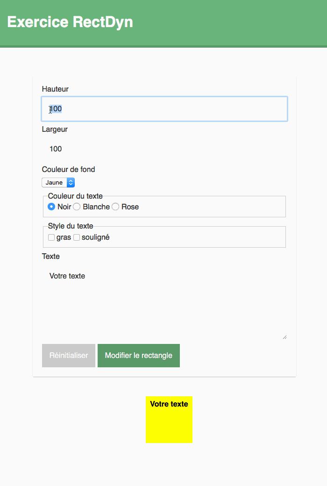

# Module 133a > Exercice “RectDyn”

## Objectifs de l’exercice

Créer un formulaire Web permettant à l’utilisateur de modifier l’aspect et le contenu d’un élément `
`.

## A lire avant de commencer

- [Manipuler une page Web via le DOM en JavaScript](https://divtec.gitbook.io/133a/javascript/dom-introduction/introduction)
- [Accéder aux éléments HTML d’une page Web en JavaScript](https://divtec.gitbook.io/133a/javascript/dom-introduction/dom-acceder)
- [Modifier les contenus textes des éléments HTML en JavaScript](https://divtec.gitbook.io/133a/javascript/dom-introduction/dom-modifier-texte)
- [Modifier le style CSS des éléments HTML en JavaScript](https://divtec.gitbook.io/133a/javascript/dom-introduction/modifier-le-style-css)
- [Gérer l’envoi d’un formulaire HTML en JavaScript](https://divtec.gitbook.io/133a/javascript/formulaires/capter-lenvoi-du-formulaire)
- [Récupérer et modifier la valeur des champs d’un formulaire HTML en JavaScript](https://divtec.gitbook.io/133a/javascript/formulaires/recuperer-la-valeur-des-champs)
- [Valider les saisies utilisateurs d’un formulaire HTML en JavaScript](https://divtec.gitbook.io/133a/javascript/formulaires/valider-les-saisies-utilisateurs)

### Tutos OpenClassrooms

- [Créez des formulaires](https://openclassrooms.com/fr/courses/1603881-creez-votre-site-web-avec-html5-et-css3/8061492-creez-des-formulaires)
- [Finalisez un formulaire et ajoutez un bouton d'envoi](https://openclassrooms.com/fr/courses/1603881-creez-votre-site-web-avec-html5-et-css3/8061499-finalisez-un-formulaire-et-ajoutez-un-bouton-denvoi)
- [Interagissez avec un élément d’une page web grâce aux événements](https://openclassrooms.com/fr/courses/7696886-apprenez-a-programmer-avec-javascript/8206297-interagissez-avec-un-element-d-une-page-web-grace-aux-evenements)
- [Récupérez la valeur d’un champ de formulaire](https://openclassrooms.com/fr/courses/7696886-apprenez-a-programmer-avec-javascript/8206488-recuperez-la-valeur-d-un-champ-de-formulaire)
    
  - et les chapitres suivants

------

## Formulaire HTML

- Créer le formulaire HTML dans le fichier `index.html` à l’endroit indiqué par les commentaires.
- Identifier le formulaire avec l’id `“formRect”`
- Structurer le formulaire avec une liste HTML non-triée.
- Labelliser et identifier chaque champs
- Donner l'autofocus au champ hauteur
- Respecter les bonnes pratiques de la création de formulaires Web.

### Détail des champs du formulaire

| Etiquette       | Type        | Valeur par défaut | Remarques|
|-----------------|-------------|-------------------|----------|
| Hauteur         | Champ texte | `"100"` | A le focus au chargement de la page |
| Largeur         | Champ texte | `"100"` |  |
| Couleur de fond | Liste déroulante | `"Jaune"` | Choix: `Bleu`, `Jaune`, `Rouge`, `Vert` |
| Couleur du texte | Groupe de radios | `"Noire"` | Choix: `Noire`, `Blanche`, `Rose` |
| Gras | Case à cocher  |  | Fait partie du groupe de champs `Style du texte` |
| Souligné | Case à cocher  |  | Fait partie du groupe de champs `Style du texte` |
| Texte | Zone de texte | `"Votre texte"` |  |
| R&eacute;initialiser | Bouton de reset |  | Réinitialise le formulaire |
| Modifier le rectangle | Bouton d'envoi |  | Envoie le formulaire |

## JavaScript

### Fonction de mise à jour du rectangle

Créer une fonction `miseAJour()` qui se déclenche lors de l’envoi du formulaire : `onsubmit`.

Travail de la fonction :

1. Vérifier que l’utilisateur à bien saisi dans les champs `hauteur` et
 `largeur` un nombre plus grand que `0` et inférieur ou égal `500`.
2. Si l’utilisateur n’a pas entré un nombre, afficher le message d’erreur
 : `alert(‘Entrez un nombre !’);`
3. Si le nombre n’est pas compris entre `0` et `500` afficher le message d
’erreur : `alert(‘Hauteur ou largeur incorrecte !’);`
4. Modifier l’aspect de la `
` `#rectangle` en fonction des préférences de
 l’utilisateur :

- Taille (champs textes hauteur et largeur)
- Couleur de fond (liste déroulante)
- Couleur du texte (boutons radios)
- Style du texte (cases à cocher)
- Texte, contenu de la `
` (zone de texte)

### Réinitialisation du formulaire et de la div

Réinitialiser le formulaire ainsi que l’aspect et le contenu de la `
`
 `#rectangle`  lors de la réinitialisation du formulaire : `onreset`.
